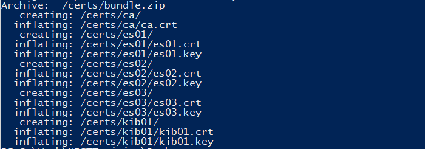

## II. PREPARING THE ELASTIC STACK CONTAINER WITH SECURITY

You will need to run the command below.

    docker-compose -f create-certs.yml run --rm create_certs

To provide more information, this command downloads and extracts security certificates for your machine to run elastic search. Elasticsearch nodes and Kibana use these certificates to identify themselves when communicating with other nodes.

After you press enter, it should show you the following:

As you can see, this installs several certificates. We will be using 3 nodes and Kibana, so this installs a certificate for each. 