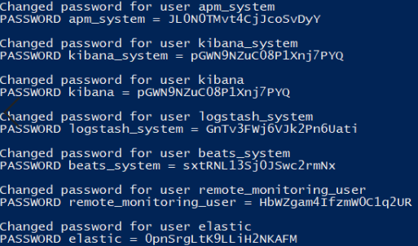

## IV. SECURING THE ELASTIC STACK AND CHANGING SETTINGS

The Elastic Stack Container you made is already configured with security. However, we will still need to personalize the authentication for your machine. To do this, we will generate your own passwords.

We will be running elasticsearch's auto setup for passwords. This is included with the installed container and as such it will be running from it.
To do just that you need to run the following: 

    docker exec es01 /bin/bash -c "bin/elasticsearch-setup-passwords auto --batch --url https://es01:9200"

This runs a batch file that will generate passwords for your use, like the following:

Take note of the passwords, this is very important. To be specific, what we need are the **kibana_system and the elastic password** for our setup.

In order to make use of the newly generated password, head to the `.env` file in the main folder
Look for **KIBANASYS_PASS** and update the value after the = to your **kibana_system password** from the generated passwords.

To update your changes, save the .env file. Since we updated settings, we will need to restart our docker container to apply it. To do that, we will need powershell or git bash again.

Once you have that open again, you'll need to navigate to the Docker Folder again. This is important because we'll need the docker-compose.yml file.

Run the following command to stop your container:

    docker-compose -f docker-compose.infrastructure.yml stop

Then to start your container again, run the command below:

    docker-compose -f docker-compose.infrastructure.yml up -d

This should now apply your changes. Note that other items on the .env file can be changed too. For now, if you want to change the ports, only if the default ports of 9200 and 5601 are used, you can do so by changing the values. In essence, you can set the ELASTIC_PORT to 9205.